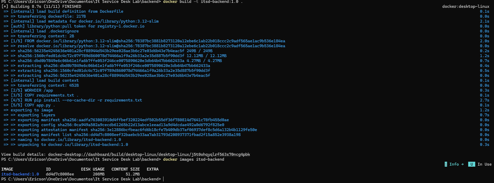
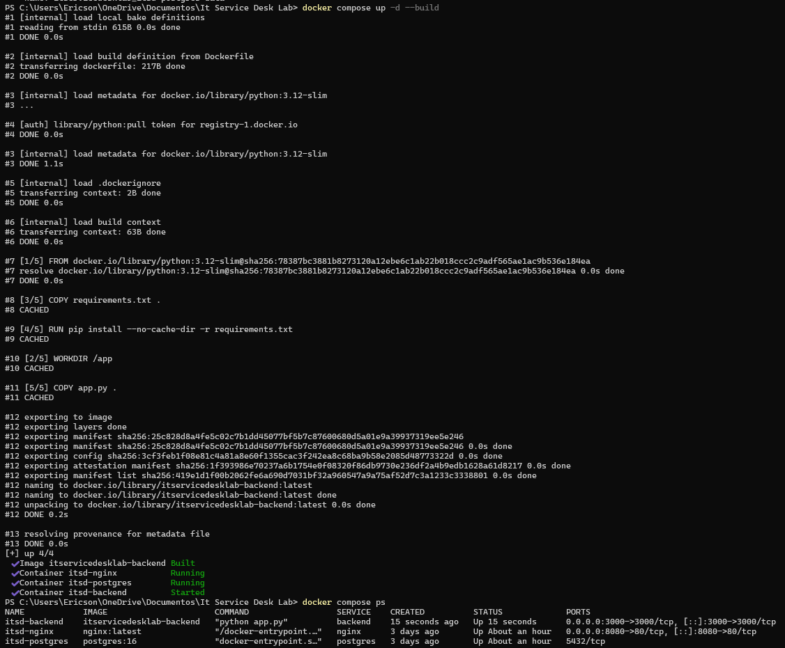
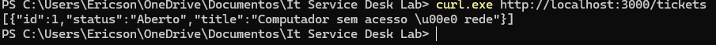
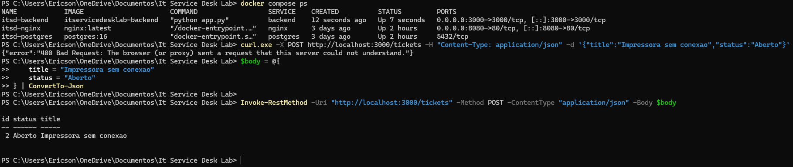

# IT Service Desk Lab — Docker Infrastructure

Laboratório prático de Docker desenvolvido para simular uma arquitetura de aplicação utilizada em um ambiente de Service Desk / Infraestrutura de TI.

O projeto começou com containers individuais e evoluiu para uma stack completa com **Nginx, API Flask e PostgreSQL**, utilizando Docker Compose, redes internas, volumes persistentes, healthchecks, variáveis de ambiente e Reverse Proxy.

O objetivo principal é demonstrar, de forma prática, conceitos utilizados em ambientes de Infraestrutura, DevOps e aplicações containerizadas.

---

## 🎯 Objetivo

Construir e documentar uma infraestrutura baseada em containers, praticando desde os fundamentos do Docker até a comunicação entre múltiplos serviços.

Durante o laboratório foram implementados conceitos como:

- Containers e imagens Docker
- Dockerfile
- Build de imagem customizada
- Port Mapping
- Docker Volumes
- Bind Mounts
- Docker Networks
- DNS interno do Docker
- Docker Compose
- PostgreSQL
- API REST com Flask
- Comunicação Backend → PostgreSQL
- Nginx Reverse Proxy
- Variáveis de ambiente
- `.env` e `.gitignore`
- Healthchecks
- `depends_on`
- Persistência de dados
- Troubleshooting através de logs

---

# 🏗️ Arquitetura Final

```text
                     CLIENTE
                        |
                        |
              http://localhost:8080
                        |
                        v
                 +-------------+
                 |    NGINX    |
                 | Reverse     |
                 | Proxy       |
                 +------+------+
                        |
                        |
                 backend:3000
                        |
                        v
                 +-------------+
                 | Flask API   |
                 |             |
                 | /health     |
                 | /tickets    |
                 +------+------+
                        |
                        |
                 postgres:5432
                        |
                        v
                +---------------+
                |  PostgreSQL   |
                |               |
                |    itsd_db    |
                |    tickets    |
                +-------+-------+
                        |
                        v
                 Docker Volume
                        |
                   Persistência
```

Todos os serviços fazem parte da rede:

```text
itsd-network
```

---

# 🧰 Tecnologias utilizadas

- Docker
- Docker Compose
- Dockerfile
- Nginx
- Python
- Flask
- Psycopg
- PostgreSQL 16
- Docker Volumes
- Docker Networks
- REST API
- Windows PowerShell
- Linux Containers
- Git
- GitHub

---

# 📁 Estrutura do projeto

```text
it-service-desk-lab/
│
├── backend/
│   ├── app.py
│   ├── Dockerfile
│   └── requirements.txt
│
├── nginx/
│   └── default.conf
│
├── screenshots/
│
├── .env.example
├── .gitignore
├── docker-compose.yml
└── README.md
```

---

# 🐳 Dockerfile

O backend utiliza uma imagem própria construída através de um Dockerfile.

```dockerfile
FROM python:3.12-slim

WORKDIR /app

COPY requirements.txt .

RUN pip install --no-cache-dir -r requirements.txt

COPY app.py .

EXPOSE 3000

CMD ["python", "app.py"]
```

A imagem pode ser construída manualmente com:

```bash
docker build -t itsd-backend:1.0 .
```

Durante o laboratório também foi validado o funcionamento do cache de camadas do Docker durante builds subsequentes.

---

# 🌐 Docker Network

Foi criada uma rede bridge personalizada:

```bash
docker network create itsd-network
```

Os serviços utilizam essa rede para comunicação interna.

Exemplo:

```text
nginx
   |
   | backend:3000
   v
backend
   |
   | postgres:5432
   v
postgres
```

O Docker fornece resolução DNS interna, permitindo utilizar nomes de serviços em vez de endereços IP.

Foi validada a resolução do serviço PostgreSQL através de:

```bash
nslookup postgres
```

Também foi testada a conectividade TCP na porta 5432:

```bash
nc -zv postgres 5432
```

---

# 🗄️ PostgreSQL

O banco de dados utiliza:

```text
Banco: itsd_db
Tabela: tickets
```

Estrutura da tabela utilizada no laboratório:

```sql
CREATE TABLE tickets (
    id SERIAL PRIMARY KEY,
    title VARCHAR(255) NOT NULL,
    status VARCHAR(50) NOT NULL
);
```

Um dos primeiros registros foi criado manualmente:

```sql
INSERT INTO tickets (title, status)
VALUES ('Computador sem acesso à rede', 'Aberto');
```

Posteriormente, a criação de tickets passou a ser realizada pela API.

---

# 🔌 API Flask

O backend foi desenvolvido utilizando Flask.

Endpoints disponíveis:

```text
GET  /
GET  /health
GET  /tickets
POST /tickets
```

## Healthcheck da API

```bash
curl http://localhost:3000/health
```

Resposta esperada:

```json
{
  "status": "healthy"
}
```

---

## Consultar tickets

Acesso direto ao backend:

```bash
curl http://localhost:3000/tickets
```

Ou através do Nginx:

```bash
curl http://localhost:8080/api/tickets
```

Exemplo de resposta:

```json
[
  {
    "id": 1,
    "status": "Aberto",
    "title": "Computador sem acesso à rede"
  },
  {
    "id": 2,
    "status": "Aberto",
    "title": "Impressora sem conexao"
  },
  {
    "id": 3,
    "status": "Aberto",
    "title": "Usuario sem acesso ao sistema"
  }
]
```

---

# ➕ Criação de tickets pela API

A API também permite criar novos chamados através de `POST /tickets`.

Exemplo utilizando PowerShell:

```powershell
$body = @{
    title = "Usuario sem acesso ao sistema"
    status = "Aberto"
} | ConvertTo-Json

Invoke-RestMethod `
    -Uri "http://localhost:8080/api/tickets" `
    -Method POST `
    -ContentType "application/json" `
    -Body $body
```

Fluxo:

```text
PowerShell
     |
     | POST /api/tickets
     v
Nginx
     |
     v
Flask Backend
     |
     | INSERT
     v
PostgreSQL
```

---

# 🔀 Nginx Reverse Proxy

O Nginx funciona como ponto de entrada para a aplicação.

Configuração utilizada:

```nginx
server {
    listen 80;

    location / {
        root /usr/share/nginx/html;
        index index.html;
    }

    location /api/ {
        proxy_pass http://backend:3000/;

        proxy_set_header Host $host;
        proxy_set_header X-Real-IP $remote_addr;
        proxy_set_header X-Forwarded-For $proxy_add_x_forwarded_for;
        proxy_set_header X-Forwarded-Proto $scheme;
    }
}
```

O acesso:

```text
http://localhost:8080/api/tickets
```

é encaminhado internamente para:

```text
http://backend:3000/tickets
```

O hostname `backend` é resolvido através do DNS interno do Docker.

---

# 🔐 Variáveis de ambiente

Credenciais e parâmetros de conexão não ficam diretamente armazenados no código da aplicação.

O projeto utiliza um arquivo:

```text
.env
```

Esse arquivo é ignorado pelo Git através do:

```text
.gitignore
```

Um arquivo de exemplo é disponibilizado:

```text
.env.example
```

Exemplo:

```env
POSTGRES_USER=itsd
POSTGRES_PASSWORD=change_me
POSTGRES_DB=itsd_db

DB_HOST=postgres
DB_PORT=5432
DB_NAME=itsd_db
DB_USER=itsd
DB_PASSWORD=change_me
```

Para utilizar o projeto, crie seu `.env` baseado no `.env.example`.

---

# ❤️ Healthchecks e dependências

O PostgreSQL possui um healthcheck utilizando:

```bash
pg_isready
```

O backend somente inicia após o PostgreSQL estar saudável.

Fluxo:

```text
PostgreSQL inicia
       |
       v
pg_isready
       |
       v
PostgreSQL HEALTHY
       |
       v
Backend inicia
```

O backend também possui seu próprio healthcheck utilizando o endpoint:

```text
/health
```

O Nginx somente inicia depois que o backend está saudável.

A sequência final de inicialização é:

```text
PostgreSQL
     |
     v
HEALTHY
     |
     v
Backend
     |
     v
HEALTHY
     |
     v
Nginx
```

---

# 💾 Persistência de dados

O PostgreSQL utiliza um Docker Volume para armazenar os dados:

```text
itsd-postgres-data
```

Durante o laboratório foi executado:

```bash
docker compose down
```

Todos os containers foram removidos.

Posteriormente:

```bash
docker compose up -d
```

A stack foi recriada.

Após a recriação, foi realizada novamente a consulta:

```bash
curl http://localhost:8080/api/tickets
```

Os três tickets permaneceram disponíveis.

Isso demonstra que:

```text
Container
   ≠
Dados
```

O ciclo de vida do container não afeta os dados armazenados no volume persistente.

---

# ⚙️ Executando o projeto

Clone o repositório:

```bash
git clone https://github.com/ericsonsantos/it-service-desk-lab.git
```

Entre no diretório:

```bash
cd it-service-desk-lab
```

Crie o arquivo `.env` baseado no exemplo:

```bash
cp .env.example .env
```

No Windows PowerShell:

```powershell
Copy-Item .env.example .env
```

Ajuste as variáveis conforme necessário.

Depois execute:

```bash
docker compose up -d --build
```

Verifique os serviços:

```bash
docker compose ps
```

Acesse a API através do Nginx:

```text
http://localhost:8080/api/tickets
```

Backend direto:

```text
http://localhost:3000
```

Healthcheck:

```text
http://localhost:3000/health
```

Para remover a stack:

```bash
docker compose down
```

---

# 🛠️ Troubleshooting realizado

Durante a construção do laboratório foram encontrados diversos problemas reais de configuração.

## Erro — `volume` em vez de `volumes`

Erro:

```text
services.nginx additional properties 'volume' not allowed
```

Causa:

```yaml
volume:
```

Correção:

```yaml
volumes:
```

---

## Erro — nome incorreto da Docker Network

Erro:

```text
service "nginx" refers to undefined network itsd-networks
```

O serviço utilizava:

```text
itsd-networks
```

enquanto a rede correta era:

```text
itsd-network
```

Após padronizar o nome, o problema foi resolvido.

---

## Erro — DNS do PostgreSQL

Durante um teste de conexão foi apresentado:

```text
could not translate host name "postgres" to address
```

Foi identificado que os containers não estavam ativos na rede naquele momento.

Após iniciar novamente a stack:

```bash
docker compose up -d
```

o serviço `postgres` voltou a ser resolvido pelo DNS interno do Docker.

---

## Erro — Nginx iniciado antes do backend

Após executar:

```bash
docker compose down
docker compose up -d
```

o container Nginx encerrou com:

```text
host not found in upstream "backend"
```

A análise foi realizada através de:

```bash
docker compose ps -a
docker compose logs nginx
```

Foi identificado que o Nginx estava tentando resolver o serviço `backend` antes de ele estar disponível.

A solução foi implementar:

```text
PostgreSQL healthcheck
        |
        v
Backend depends_on PostgreSQL
        |
        v
Backend healthcheck
        |
        v
Nginx depends_on Backend
```

Após a alteração:

```text
itsd-postgres → healthy
itsd-backend  → healthy
itsd-nginx    → running
```

Esse cenário demonstrou na prática a importância de healthchecks e dependências entre serviços em aplicações distribuídas.

---

# 📸 Evidências do laboratório

Abaixo estão algumas das principais evidências da evolução do projeto.

## Build da imagem própria do backend

Construção da imagem Docker utilizando o `Dockerfile` criado para a aplicação Flask.



---

## Stack com múltiplos serviços

Execução do ambiente contendo Nginx, Backend Flask e PostgreSQL através do Docker Compose.



---

## Backend consultando o PostgreSQL

Validação da comunicação entre a API Flask e o banco PostgreSQL através da Docker Network.



---

## Criação de ticket através da API

Criação de um novo chamado utilizando uma requisição HTTP `POST`, com persistência no PostgreSQL.



---

## Nginx atuando como Reverse Proxy

Acesso à API através do Nginx utilizando:

```text
http://localhost:8080/api/tickets

---

# 📚 Principais conhecimentos praticados

O laboratório permitiu praticar conceitos relacionados a:

```text
Docker
Dockerfile
Docker Compose
Containers
Images
Volumes
Bind Mounts
Networks
DNS
PostgreSQL
Python
Flask
REST API
Nginx
Reverse Proxy
Healthchecks
Environment Variables
Persistent Storage
Troubleshooting
Git
GitHub
```

---

# ✅ Resultado

Ao final do laboratório foi construída uma aplicação containerizada composta por três serviços integrados:

```text
Nginx
   ↓
Flask Backend
   ↓
PostgreSQL
```

Com:

```text
Reverse Proxy
Docker DNS
Rede personalizada
Imagem própria
API REST
Persistência
Healthchecks
Dependências entre serviços
Variáveis de ambiente
Troubleshooting
```

O projeto representa a evolução de um ambiente Docker básico para uma arquitetura multi-container funcional e documentada.